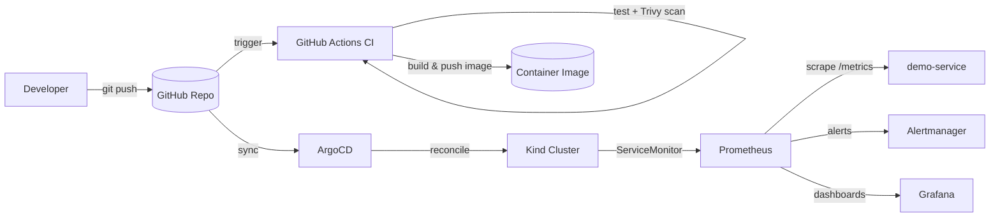

# GitOps Platform — Production-grade, Local-first

A self-contained, **zero-cost** reference platform that demonstrates the full
DevOps delivery chain on a local Kubernetes cluster (Kind):

- **Infrastructure as Code** mindset — everything is declarative and lives in Git
- **GitOps** continuous delivery with ArgoCD (Git is the single source of truth)
- **CI/CD** with security scanning (Trivy) baked in before anything ships
- **Observability** — Prometheus metrics, Grafana dashboards, and alerting rules
- **Progressive delivery** (optional) — Argo Rollouts canary with automated
  metric-based promotion and rollback

> Clone it, `make up`, and you have a working platform you can show in an
> interview or put on your resume. No cloud bill required.

---

## What this repo demonstrates (resume-ready)

- Built a **production-grade Kubernetes GitOps platform** from scratch, fully
  codified in Git and runnable end-to-end on a laptop via Kind.
- Implemented **CI/CD with shift-left security**: unit tests + filesystem/image
  vulnerability scanning (Trivy) gate every merge and image push.
- Used **ArgoCD** for declarative, automated synchronization (prune + self-heal)
  so cluster state always converges to Git.
- Shipped **observability by default**: Prometheus `ServiceMonitor`, alert rules
  (error-rate / latency SLOs), and a Grafana dashboard.
- Added **progressive delivery** via Argo Rollouts with a Prometheus-driven
  `AnalysisTemplate` for automated canary promotion and rollback.

---

## Architecture



---

## Prerequisites

- [Docker](https://docs.docker.com/get-docker/)
- [Kind](https://kind.sigs.k8s.io/docs/user/quick-start/#installation)
- [kubectl](https://kubernetes.io/docs/tasks/tools/)
- [helm](https://helm.sh/docs/intro/install/)

---

## Quick start (local, zero cost)

> **Choose your path:**
> - **Fast path** — no GitHub account, no ArgoCD. Deploys the service directly
>   with `kubectl` + `helm` so you can see it working in minutes.
> - **GitOps path** — the "real" demo. Requires pushing this repo to GitHub
>   first, because ArgoCD syncs *from* Git.

### Fast path (no GitHub, no ArgoCD)

```bash
make kind-up
make ingress-up
make build
make kind-load
make local-apply        # kubectl + helm apply, no ArgoCD needed
make observability-up
make status
make smoke-test
```

### GitOps path (push the repo to GitHub first)

ArgoCD pulls manifests from a Git repo, so the `argocd-up` step needs a real
remote URL. Initialize git, commit, and push to GitHub, then:

```bash
# 1. Create the local cluster
make kind-up
make ingress-up

# 2. Build & load the demo image into Kind (no registry needed)
make build
make kind-load

# 3. Install ArgoCD and let it sync everything from Git
export REPO_URL=https://github.com/<your-user>/gitops-platform.git
make argocd-up

# 4. Install observability (Prometheus + Grafana + alerts)
make observability-up

# 5. Check status and try it
make status
make smoke-test
make port-forward
```

- Demo service:  **http://demo.local** (or `http://localhost:8080` via port-forward)
- ArgoCD UI:     `kubectl -n argocd port-forward svc/argocd-server 8080:443`
  (password: `make argocd-password`, user: `admin`)
- Grafana:       `http://localhost:3000` (admin / prom-operator)
- Prometheus:    `http://localhost:9090`

> Add `127.0.0.1 demo.local` to your `/etc/hosts` to use the ingress host.

---

## Optional: progressive delivery (canary + auto rollback)

```bash
make rollouts-up
```

This replaces the standard Deployment with an Argo Rollouts `Rollout` that
shifts 20% → 50% traffic with pauses, and runs a Prometheus `AnalysisTemplate`
(error ratio ≤ 10%). If the canary breaches the SLO, the rollout automatically
aborts and reverts — no human in the loop.

---

## Repository layout

```
gitops-platform/
├── apps/demo-service/        # sample app: src, Dockerfile, tests, Helm chart
│   ├── src/server.js         # zero-dep HTTP service exposing /metrics
│   └── helm/                 # Deployment, Service, Ingress, ServiceMonitor
├── argocd/                   # app-of-apps + child Application (GitOps)
├── observability/            # PrometheusRule alerts + Grafana dashboard
├── rollouts/                 # optional Argo Rollouts canary + AnalysisTemplate
├── bootstrap/                # Kind cluster config + ArgoCD installer
├── scripts/smoke-test.sh     # quick HTTP smoke test
├── .github/workflows/ci.yml  # test + Trivy scan + build + push
├── Makefile                  # one-command platform lifecycle
└── docs/architecture.md      # deeper architecture notes
```

---

## Going to the cloud (optional)

The platform is intentionally cloud-agnostic. Swap the local Kind cluster for a
managed control plane (EKS/GKE/ACK) and point ArgoCD at the same Git repo — the
Helm charts, ArgoCD manifests, and observability config are unchanged. A
Terraform module for the cloud control plane can be dropped in under
`infra/` without touching the delivery layer.

---

## License

MIT — see [LICENSE](./LICENSE).
